<tr>
      <td style="width: 100%; border: none; vertical-align: top; text-align: right;"><strong style="font-size: 22px; color: #000080;">Welcome</strong> 
      </td>
</tr>

  <i style="display: block; margin: 30px 0 50px 0;">
    Our lab aims to uncover the fundamental physics mechanisms in nature. We conduct state-of-the-art research in computational physics and related. We value a wide diversity of views and interdisciplinary thoughts that brings fresh thinking into the understanding of nature.  
  </i>

 
 
___

  <table style="width: 100%; font-size: 17px; border-collapse: collapse; border: none;">
    <tr>
      <td style="color: #000080; font-size: 20px; width: 20%; border: none; vertical-align: top; text-align: right;"><strong>Lab News</strong></td>
     </tr>

    
<tr>
      <td style="color: #7a2b2b; width: 20%; border: none; vertical-align: top; text-align: right;">Jan 2026</td>
      <td style="border: none; word-wrap: break-word;"><strong><i>Xuezhi</i></strong> signs an industry-sponsored project with <i>D. Co</i>. </td>
    </tr>

<tr>
      <td style="color: #7a2b2b; width: 20%; border: none; vertical-align: top; text-align: right;">Dec 2025</td>
      <td style="border: none; word-wrap: break-word;"><strong><i>Dr. Linghu</i></strong> is appointed as an <strong><i>associate professor</i></strong> in physics. Congrats！</td>
    </tr>

<tr>
      <td style="color: #7a2b2b; width: 20%; border: none; vertical-align: top; text-align: right;"></td>
      <td style="border: none; word-wrap: break-word;"><strong><i>Xuezhi</i></strong> is enrolled as a <strong><i>Visiting scholar</i></strong> of <i>I-Habor, Xi'an Jiaotong University</i>. And <strong><i>Zhengwang</i></strong> is enrolled as a <strong><i>Jointly trained graduates</i></strong> with <i>XJTU</i>.</td>
    </tr>
    
<tr>
      <td style="color: #7a2b2b; width: 20%; border: none; vertical-align: top; text-align: right;"></td>
      <td style="border: none; word-wrap: break-word;"><strong><i>Yifan</i></strong> launches the <i>All Good Project</i>.</td>
    </tr>

<tr>
      <td style="color: #7a2b2b; width: 20%; border: none; vertical-align: top; text-align: right;">Nov 2025</td>
      <td style="border: none; word-wrap: break-word;"><strong><i>Xuezhi</i></strong> is invited to give a talk at <em>IWMM 2025</em> at <em>Shaanxi University of Science & Technology, Xi'an</em>.</td>
    </tr>

<tr>
  <td style="border: none;"></td>
  <td style="border: none; text-align: left;">
    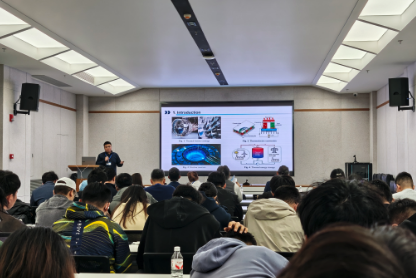
    <!--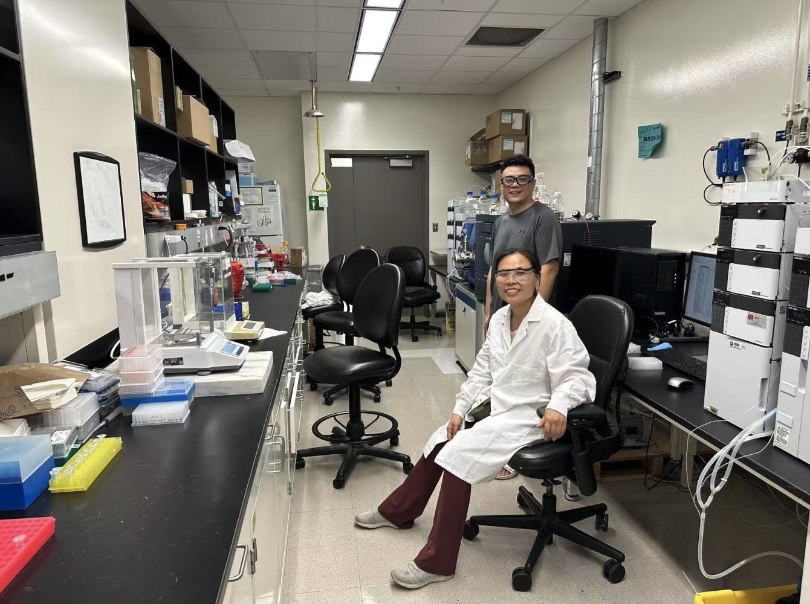-->
  </td>
</tr>

<tr>
      <td style="color: #7a2b2b; width: 20%; border: none; vertical-align: top; text-align: right;"></td>
      <td style="border: none; word-wrap: break-word;"><strong><i>Zhengwang, Zhihao, Isha, Beijie and Simiao</i></strong> give their research reports at group meeting.</td>
    </tr>

<tr>
  <td style="border: none;"></td>
  <td style="border: none; text-align: left;">
    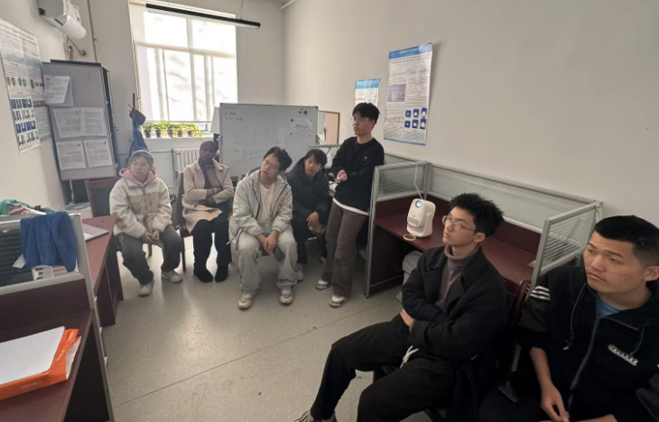
    
  </td>
</tr>

<tr>
      <td style="color: #7a2b2b; width: 20%; border: none; vertical-align: top; text-align: right;"></td>
      <td style="border: none; word-wrap: break-word;"><strong><i>Simiao Yan</i></strong> joins our lab for undergraduate internship. Welcome!</td>
    </tr>

<tr>
      <td style="color: #7a2b2b; width: 20%; border: none; vertical-align: top; text-align: right;"></td>
      <td style="border: none; word-wrap: break-word;"><strong><i>Lei</i></strong> and <strong><i>Yifan</i></strong> launch the <i>TS</i> software v1.0.</td>
    </tr>

<tr>
      <td style="color: #7a2b2b; width: 20%; border: none; vertical-align: top; text-align: right;">Oct 2025</td>
      <td style="border: none; word-wrap: break-word;"><strong><i>Yifan</i></strong> is invited as the session chair of <em>Asymmetric U-Net with Gaussian Splatting for Single-View 3D Reconstruction (I)</em> at <em>IEEE SMC 2025, Vienna, Austria</em>.</td>
    </tr>

<tr>
  <td style="border: none;"></td>
  <td style="border: none; text-align: left;">
    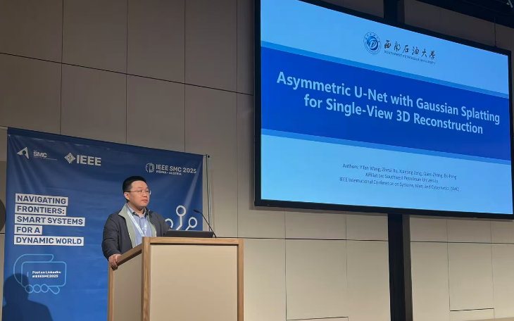
    <!---->
  </td>
</tr>

<tr>
      <td style="color: #7a2b2b; width: 20%; border: none; vertical-align: top; text-align: right;"></td>
      <td style="border: none; word-wrap: break-word;"><strong><i>Xuezhi</i></strong> visits <strong><i>Prof. Kefu Yi</i></strong> at <em>Changsha University of Science & Technology, Changsha</em>.</td>
    </tr>

<tr>
  <td style="border: none;"></td>
  <td style="border: none; text-align: left;">
    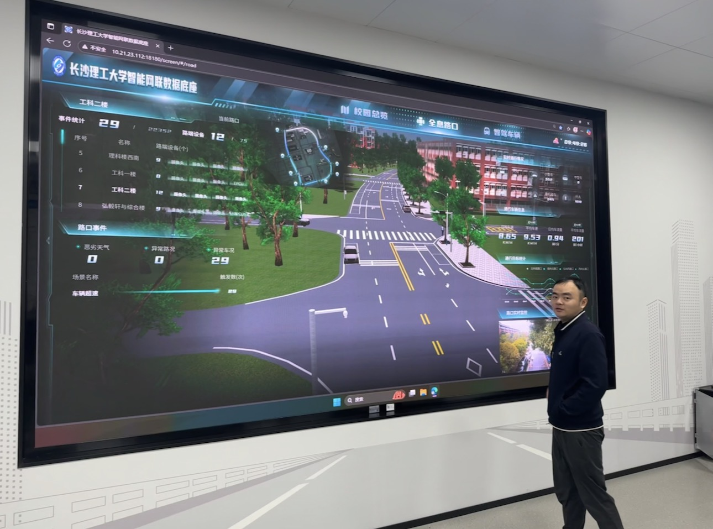
    <!---->
  </td>
</tr>

 <tr>
      <td style="color: #7a2b2b; width: 20%; border: none; vertical-align: top; text-align: right;">Sep 2025</td>
      <td style="border: none; word-wrap: break-word;"><strong><i>Xuezhi</i></strong> and <strong><i>Jiajun</i></strong> attend <em>CPS Fall meeting 2025</em>, <em>Harbin</em>.</td>
    </tr>

<tr>
  <td style="border: none;"></td>
  <td style="border: none; text-align: left;">
    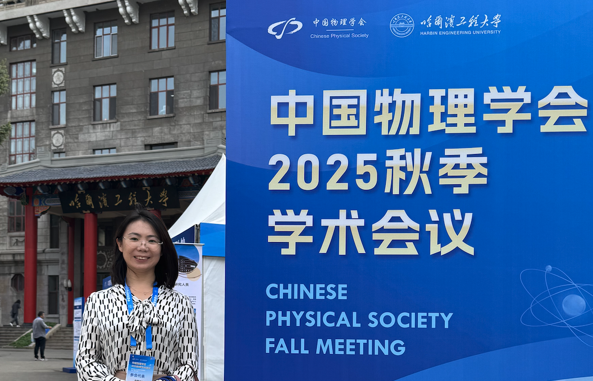
    <!---->
  </td>
</tr>

 <tr>
      <td style="color: #7a2b2b; width: 20%; border: none; vertical-align: top; text-align: right;"></td>
      <td style="border: none; word-wrap: break-word;"><strong><i>Junwei</i></strong> gets the work <em>Synergistically Enhanced Thermophysical and Mechanical Properties of La2(Hf1‒xCex)2O7 for Thermal Barrier Coatings</em> published on <em>Ceramics International</em>.</td>
    </tr>

 <tr>
      <td style="color: #7a2b2b; width: 20%; border: none; vertical-align: top; text-align: right;"></td>
      <td style="border: none; word-wrap: break-word;"><strong><i>Xuezhi</i></strong> is selected by the editor as a potential reviewer for <strong><em>Nature Communications</em></strong>.</td>
    </tr>

 <tr>
      <td style="color: #7a2b2b; width: 20%; border: none; vertical-align: top; text-align: right;">Aug 2025</td>
      <td style="border: none; word-wrap: break-word;"><strong><i>Xuezhi</i></strong> and <strong><i>Zhengwang</i></strong> get the paper <em>An atomic perspective of crack propagation under thermal stress field at high temperature in biphase high-entropy coupled ceramics composites</em> published on <em>Materials Today Communications</em>.</td>
    </tr>

<tr>
      <td style="color: #7a2b2b; width: 20%; border: none; vertical-align: top; text-align: right;"></td>
      <td style="border: none; word-wrap: break-word;"><strong><i>Xuezhi</i></strong> visits <strong><i>Dr. Lu Wang</i></strong> at <em>College of Pharmacy, the University of Michigan, Ann Arbor, MI, United States</em>.</td>
    </tr>

<tr>
  <td style="border: none;"></td>
  <td style="border: none; text-align: left;">
    
    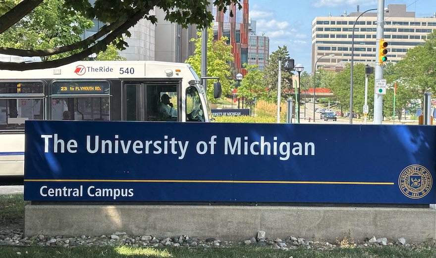
  </td>
</tr>

 <tr>
      <td style="color: #7a2b2b; width: 20%; border: none; vertical-align: top; text-align: right;">Jul 2025</td>
      <td style="border: none; word-wrap: break-word;"><strong><i>Zhengwang</i></strong> wins the <strong><i>Outstanding Award</i></strong> from <em>The Academic Forum on Frontiers of Basic Disciplines and Innovation in Interdisciplinary Studies</em>!</td>
    </tr>

 <tr>
      <td style="color: #7a2b2b; width: 20%; border: none; vertical-align: top; text-align: right;"></td>
      <td style="border: none; word-wrap: break-word;"><strong><i>Jiajun</i></strong> and <strong><i>Xuezhi</i></strong> give invited talks at <em>CMC 2025, Xiamen.</em></td>
    </tr>

<tr>
  <td style="border: none;"></td>
  <td style="border: none; text-align: left;">
    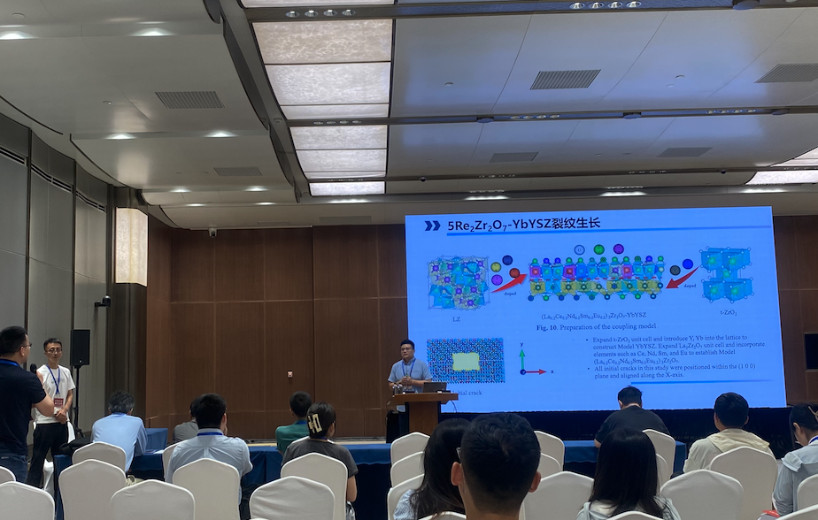
    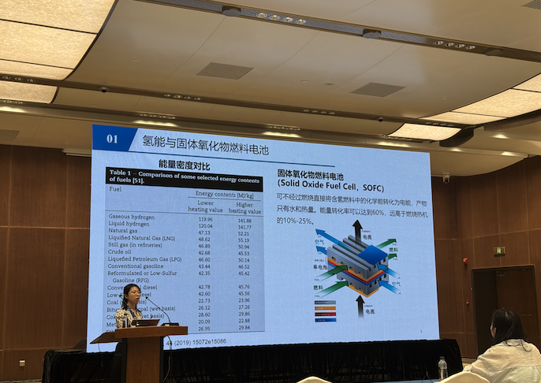
  </td>
</tr>

 <tr>
      <td style="color: #7a2b2b; width: 20%; border: none; vertical-align: top; text-align: right;">Jun 2025</td>
      <td style="border: none; word-wrap: break-word;"><strong><i>Xinying Quan</i></strong>, <strong><i>Haoran Zhang</i></strong> and <strong><i>Xiaona Sun</i></strong> join our lab for undergraduate internship. Welcome!</td>
    </tr>

 <tr>
      <td style="color: #7a2b2b; width: 20%; border: none; vertical-align: top; text-align: right;"></td>
      <td style="border: none; word-wrap: break-word;"><strong><i>Yousra</i></strong> gives a talk on <i>Dimension</i>, and <strong><i>Isha</i></strong> gives a talk on <i>Quantum Entanglement</i> to the undergraduates from Physics Department. Excellent Job!</td>
    </tr>

<tr>
  <td style="border: none;"></td>
  <td style="border: none; text-align: left;">
    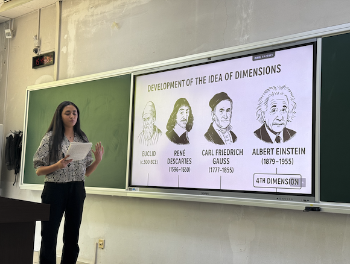
    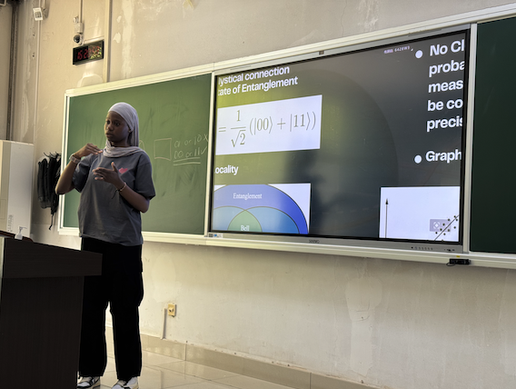
    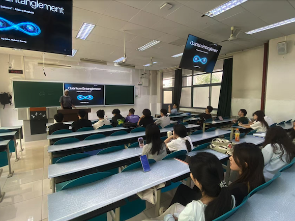
  </td>
</tr>

 <tr>
      <td style="color: #7a2b2b; width: 20%; border: none; vertical-align: top; text-align: right;">May 2025</td>
      <td style="border: none; word-wrap: break-word;"><strong><i>Junwei</i></strong> recieves a funding from <i>Natural Science Basic Research Program of Shaanxi Province</i>.</td>
    </tr>

 <tr>
      <td style="color: #7a2b2b; width: 20%; border: none; vertical-align: top; text-align: right;"></td>
      <td style="border: none; word-wrap: break-word;"><strong><i>Jiajun</i></strong> gives a lecture at <i>Yanshan University, Qinhuangdao</i>. </td>
    </tr>

   <tr>
      <td style="color: #7a2b2b; width: 20%; border: none; vertical-align: top; text-align: right;"></td>
      <td style="border: none; word-wrap: break-word;"><strong><i>Jiajun</i></strong> recieves a funding from <i>Fundamental Research Funds for the Central Universities</i>. </td>
    </tr>

 <tr>
      <td style="color: #7a2b2b; width: 20%; border: none; vertical-align: top; text-align: right;">Apr 2025</td>
      <td style="border: none; word-wrap: break-word;"><strong><i>Yifan</i></strong> and <strong><i>Jianlin</i></strong> release <em>RM software</em> v1.0.</td>
    </tr>

<tr>
      <td style="color: #7a2b2b; width: 20%; border: none; vertical-align: top; text-align: right;"></td>
      <td style="border: none; word-wrap: break-word;"><strong><i>Zhengwang</i></strong> and <strong><i>Xuezhi</i></strong> attend <em>the 9th National Congress of Magnetic Materials and Devices</em> at <em>Nanjing</em>. <strong><i>Xuezhi</i></strong> is invited as a committee member on <em>the Forum of Condensed Matter Physics.</em></td>
    </tr>

<tr>
      <td style="color: #7a2b2b; width: 20%; border: none; vertical-align: top; text-align: right;"></td>
      <td style="border: none; word-wrap: break-word;"><strong><i>Xuezhi</i></strong> visits <strong><i>Prof. Yusheng Wang</i></strong> at <em>Nanjing University of Information Science & Technology, Nanjing</em>.</td>
    </tr>

<tr>
  <td style="border: none;"></td>
  <td style="border: none; text-align: left;">
    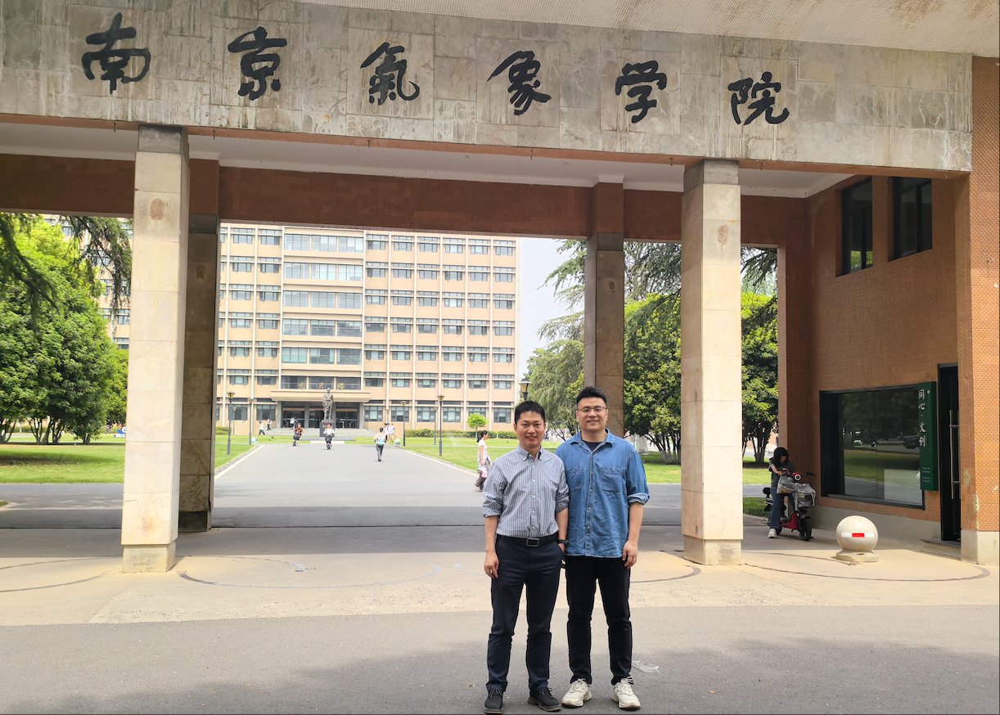
    <!---->
  </td>
</tr>

<tr>
      <td style="color: #7a2b2b; width: 20%; border: none; vertical-align: top; text-align: right;"></td>
      <td style="border: none; word-wrap: break-word;"><strong><i>Jiajun</i></strong> and <strong><i>Xuezhi</i></strong> visit <strong><i>Prof. Songrui Wei</i></strong> at <em>Shenzhen University, Shenzhen</em>.</td>
    </tr>

<tr>
  <td style="border: none;"></td>
  <td style="border: none; text-align: left;">
    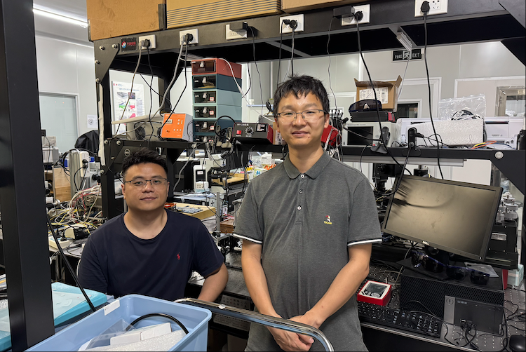
    <!---->
  </td>
</tr>

 <tr>
      <td style="color: #7a2b2b; width: 20%; border: none; vertical-align: top; text-align: right;"></td>
      <td style="border: none; word-wrap: break-word;"><strong><i>Jiajie Zhang</i></strong>, <strong><i>Zhihao Zhou</i></strong>, <strong><i>Tianjun Wen</i></strong>, <strong><i>Zidong Liang</i></strong>, <strong><i>Isha Abdulai Turay</i></strong> and <strong><i>Yousra El Mouloudi</i></strong> join our lab for undergraduate internship. Welcome!</td>
    </tr>

    <tr>
      <td style="color: #7a2b2b; width: 20%; border: none; vertical-align: top; text-align: right;">Mar 2025</td>
      <td style="border: none; word-wrap: break-word;"><strong><i>Dr. Lu Wang</i></strong> joins our lab as a research associate from <em>The University of Michigan, MI, United States</em>. Welcome!</td>
    </tr>
    
 <tr>
      <td style="color: #7a2b2b; width: 20%; border: none; vertical-align: top; text-align: right;"></td>
      <td style="border: none; word-wrap: break-word;"><strong><i>Xuezhi</i></strong> visits the <em><strong>NVIDIA GPU Education Center</strong></em> and <em><strong>NVIDIA CUDA Teaching Center</strong></em> with <strong><i>Yifan</i></strong> at <em>Southwest Petroleum University, Chengdu.</em></td>
    </tr>

<tr>
  <td style="border: none;"></td>
  <td style="border: none; text-align: left;">
    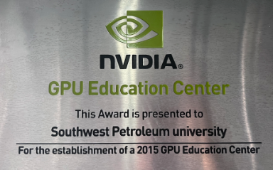
   
  </td>
</tr>

      
    <tr>
      <td style="color: #7a2b2b; width: 20%; border: none; vertical-align: top; text-align: right;">Feb 2025</td>
      <td style="border: none; word-wrap: break-word;"><strong><i>Xuezhi</i></strong> visits <em>The University of Virginia, VA, United States</em>.</td>
    </tr>

<tr>
  <td style="border: none;"></td>
  <td style="border: none; text-align: left;">
    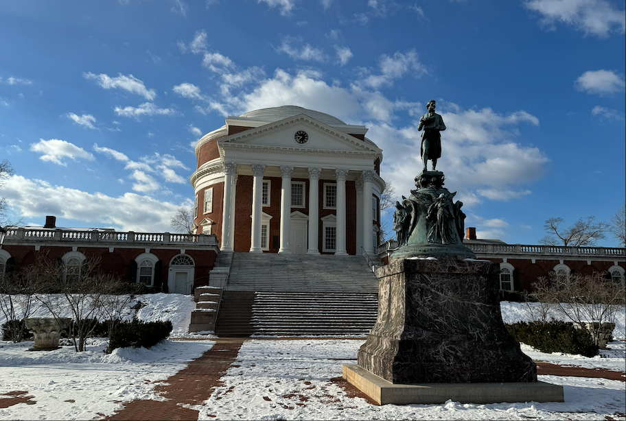
   
  </td>
</tr>

    
    <tr>
      <td style="color: #7a2b2b; width: 20%; border: none; vertical-align: top; text-align: right;"></td>
      <td style="border: none; word-wrap: break-word;"><strong><i>Beijie Hu</i></strong>, <strong><i>Xuan Zeng</i></strong> and <strong><i>Ssegawa Raymond Mark</i></strong> join our lab for undergraduate internship. Welcome!</td>
    </tr>
    
    <tr>
      <td style="color: #7a2b2b; width: 20%; border: none; vertical-align: top; text-align: right;">Jan 2025</td>
      <td style="border: none; word-wrap: break-word;"> <strong><i>Zhengwang</i></strong> and <strong><i>Jiajun</i></strong> have the paper <em>A highly polarization-sensitive near-infrared photodetector based on two-dimensional germanane/a-CdS heterostructure</em> got published on <em>2D Materials</em>.</td> 
    </tr>
    
    <tr>
      <td style="color: #7a2b2b; border: none; vertical-align: top; text-align: right;">Dec 2024</td>
      <td style="border: none;"><strong><i>Xuezhi</i></strong> receives a grant from <strong>NSFC</strong>. The <strong>THIRD ONE</strong>! </td>
    </tr>
    
    <tr>
      <td style="color: #7a2b2b; border: none; vertical-align: top; text-align: right;">Nov 2024</td>
      <td style="border: none;"><strong><i>Xuezhi</i></strong> signs an industry-sponsored project with <em>Lin Corp</em>.</td>
    </tr>

    
    <tr>
     <td style="color: #7a2b2b; border: none; vertical-align: top; text-align: right;">Oct 2024</td>
     <td style="border: none;"><strong><i>Jiajun</i></strong> and <strong><i>Xuezhi</i></strong> are invited to give a talk at <em>CPS Fall Meeting 2024, Haikou.</em></td>
    </tr>
    
    <tr>
      <td style="color: #7a2b2b; border: none; vertical-align: top; text-align: right;"></td>
      <td style="border: none;"><strong><i>Xuezhi</i></strong> attends <em>School and Workshop on Frontiers of Nanomechanics</em> hosted by <strong>the Abdus Salam International Centre for Theoretical Physics (ICTP)</strong> at <em>Trieste, Italy</em>. <a href="https://indico.ictp.it/event/10507/" target="_blank">More</a></td>
    </tr>

    
<tr>
  <td style="border: none;"></td>
  <td style="border: none; text-align: left;">
    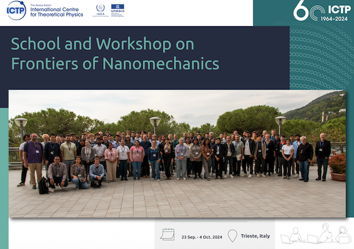
    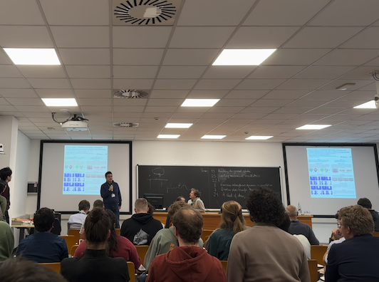
  </td>
</tr>

    
    <tr>
      <td style="color: #7a2b2b; border: none; vertical-align: top; text-align: right;">Sep 2024</td>
      <td style="border: none;"><strong><i>Zhengwang Chen</i></strong> joins our lab as a master student. Welcome aboard!</td>
    </tr>
    
    <tr>
      <td style="color: #7a2b2b; border: none; vertical-align: top; text-align: right;">Aug 2024</td>
      <td style="border: none;"><strong><i>Jiajun</i></strong> and <strong><i>Xuezhi</i></strong> give invited talks at <em>the 2nd World Materials Conference, Guangzhou</em>.</td>
    </tr>

<tr>
      <td style="color: #7a2b2b; width: 20%; border: none; vertical-align: top; text-align: right;"></td>
      <td style="border: none; word-wrap: break-word;"><strong><i>Xuezhi</i></strong> visits <em>Tsinghua University, Beijing</em>.</td>
    </tr>
    
    <tr>
      <td style="color: #7a2b2b; border: none; vertical-align: top; text-align: right;">Jul 2024</td>
      <td style="border: none;"> <strong><i>Junwei</i></strong> has his work <em>Dual-channel phonon transport leads to low thermal conductivity in pyrochlore La2Hf2O7</em> got published on <em>Ceramics International</em>.</td>
    </tr>
    
    <tr>
      <td style="color: #7a2b2b; width: 20%; border: none; vertical-align: top; text-align: right;">Dec 2023</td>
      <td style="border: none; word-wrap: break-word;"><strong><i>Xuezhi</i></strong> visits <em>Cornell University, NY, United States</em>.</td>
    </tr>

<tr>
  <td style="border: none;"></td>
  <td style="border: none; text-align: left;">
    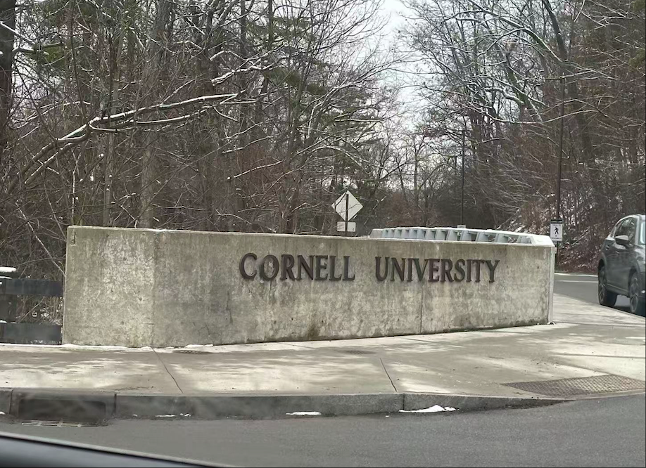
   
  </td>
</tr>

  <tr>
      <td style="color: #7a2b2b; width: 20%; border: none; vertical-align: top; text-align: right;">Oct 2023</td>
      <td style="border: none; word-wrap: break-word;"> <strong><i>Yifan</i></strong> has his work <em>Four-phonon scattering significantly reduces the predicted lattice thermal conductivity in penta-graphene: A machine learning-assisted investigation</em> published on <em>Computational Materials Science</em>. </td> 
    </tr>
    
     <tr>
      <td style="color: #7a2b2b; width: 20%; border: none; vertical-align: top; text-align: right;">Sep 2023</td>
      <td style="border: none; word-wrap: break-word;"> <strong><i>Wenjie</i></strong> and <strong><i>Junwei</i></strong> has the work <em>Thermal transport properties and lattice vibration modes in crystalline and amorphous LaMgAl11O19</em> published on <em>Journal of Alloys and Compounds</em>. </td> 
    </tr>

    <tr>
      <td style="color: #7a2b2b; width: 20%; border: none; vertical-align: top; text-align: right;">Jun 2023</td>
      <td style="border: none; word-wrap: break-word;"><strong><i>Jiajun</i></strong> attends <em>the 11th International Conference on Materials for Advanced Technologies, Singapore</em>.</td>
    </tr>

<tr>
  <td style="border: none;"></td>
  <td style="border: none; text-align: left;">
    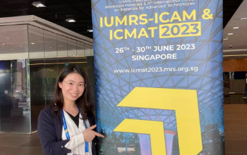
    
  </td>
</tr>

    
    <tr>
      <td style="color: #7a2b2b; border: none; vertical-align: top; text-align: right;">Mar 2023</td>
      <td style="border: none;"> <strong><i>Jiajun</i></strong> has her work <em>Computational prediction of stable semiconducting Zn-C binary compounds</em> got published on <em>Materials Science in Semiconductor Processing</em>.</td>
    </tr>
    
    <tr>
      <td style="color: #7a2b2b; border: none; vertical-align: top; text-align: right;"></td>
      <td style="border: none;"><strong><i>Xuezhi</i></strong> has a publication <em>Mechanism of amorphous-like thermal conductivityin binary oxide Yb3TaO7</em> on <em>Acta Physica Sinica</em>.</td>
    </tr>
    
    <tr>
      <td style="color: #7a2b2b; border: none; vertical-align: top; text-align: right;">Jan 2023</td>
      <td style="border: none;"><strong><i>Xuezhi</i></strong> gets the work <em>Mechanism of crack propagation in penta-graphene</em> published on <em>Vacuum</em>.</td>
    </tr>
    
    <tr>
      <td style="color: #7a2b2b; border: none; vertical-align: top; text-align: right;">Nov 2022</td>
      <td style="border: none;"><strong><i>Xuezhi</i></strong> gets a paper <em>Effect of yttria on thermal transport and vibrational modes in yttria-stabilized hafnia</em> published on <em>Ceramics International</em>.</td>
    </tr>

    <tr>
      <td style="color: #7a2b2b; border: none; vertical-align: top; text-align: right;">Sep 2022</td>
      <td style="border: none;"><strong><i>Junwei</i></strong> gets his work <em>Fluctuating bonding leads to glass-like thermal conductivity in perovskite rare-earth tantalates</em> published on <strong><em>Acta Materialia</em></strong>. Congratulations!</td>
    </tr>
    
    <tr>
      <td style="color: #7a2b2b; border: none; vertical-align: top; text-align: right;">Aug 2022</td>
      <td style="border: none;"><strong><i>Xuezhi</i></strong> receives the second grant from <strong>NSFC</strong>. </td>
    </tr>

 <tr>
      <td style="color: #7a2b2b; width: 20%; border: none; vertical-align: top; text-align: right;">Jun 2022</td>
      <td style="border: none; word-wrap: break-word;"><strong><i>Xuezhi</i></strong> recieves the second funding from <i>Fundamental Research Funds for the Central Universities</i>. </td>
    </tr>

    <tr>
      <td style="color: #7a2b2b; border: none; vertical-align: top; text-align: right;">Mar 2022</td>
      <td style="border: none;"><strong><i>Junwei</i></strong> gets his work <em>Ultralow oxygen ion diffusivity in pyrochlore-type La2(Zr0.7Ce0.3)2O7</em> published on <em>Journal of Materials Science & Technology</em>.</td>
    </tr>

    <tr>
      <td style="color: #7a2b2b; border: none; vertical-align: top; text-align: right;">Jan 2022</td>
      <td style="border: none;"><strong><i>Junwei</i></strong> gets his work <em>Thermal transport property in pyrochlore-type and fluorite-type A2B2O7 oxides by molecular dynamics simulation</em> published on <em>International Journal of Heat and Mass Transfer</em>.</td>
    </tr>
    
    <tr>
      <td style="color: #7a2b2b; width: 20%; border: none; vertical-align: top; text-align: right;">Mar 2021</td>
      <td style="border: none; word-wrap: break-word;"> <strong><i>Junwei</i></strong> has his paper <em>Outstanding sintering resistance in pyrochlore-type La2(Zr0.7Ce0.3)2O7 for thermal barrier coatings material</em> got published on <em>Ceramics International.</em></td> 
    </tr>
    
     <tr>
      <td style="color: #7a2b2b; width: 20%; border: none; vertical-align: top; text-align: right;">Sep 2020</td>
      <td style="border: none; word-wrap: break-word;"> <strong><i>Xuezhi</i></strong> has two paper <em>The effects of interface layer in LZ/YSZ coupled system during thermal transportation at elevated temperatures: A molecular dynamics simulation study</em> and <em>Porous effects on heat transfer and ions distribution in YSZ using molecular dynamics simulation</em> got published on <em>Chemical Physics Letters.</em></td> 
    </tr>
    
    <tr>
      <td style="color: #7a2b2b; border: none; vertical-align: top; text-align: right;">Mar 2020</td>
      <td style="border: none;"><strong><i>Jiajun</i></strong> and <strong><i>Xuezhi</i></strong> both get supports from <i>Natural Science Basic Research Program of Shaanxi Province</i>. </td>
    </tr>
    
      <tr>
      <td style="color: #7a2b2b; border: none; vertical-align: top; text-align: right;">Jan 2020</td>
      <td style="border: none;"><strong><i>Xuezhi</i></strong> visits <em>The University of Tulsa, OK, United States</em>.</td>
    </tr>

<tr>
  <td style="border: none;"></td>
  <td style="border: none; text-align: left;">
    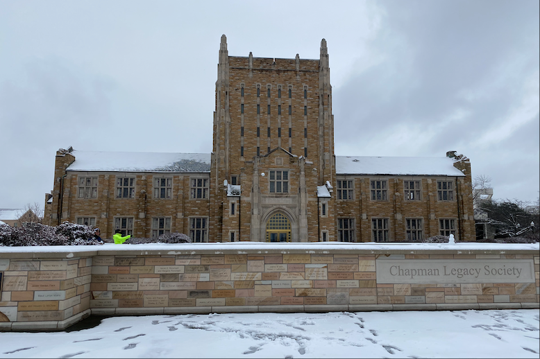
    
  </td>
</tr>

<tr>
      <td style="color: #7a2b2b; width: 20%; border: none; vertical-align: top; text-align: right;"></td>
      <td style="border: none; word-wrap: break-word;"><strong><i>Jiajun</i></strong> and <strong><i>Xuezhi</i></strong> recieve fundings from <i>Fundamental Research Funds for the Central Universities</i>. </td>
    </tr>
    
     <tr>
      <td style="color: #7a2b2b; border: none; vertical-align: top; text-align: right;">Oct 2019</td>
      <td style="border: none;"><strong><i>Xuezhi</i></strong> receives a grant from <strong>NSFC</strong>. The <strong>FIRST ONE</strong>! </td>
    </tr>
    
  </table>

---

  <i style="display: block; margin: 80px 0 0px 0;">
    We do something new.
  </i>

