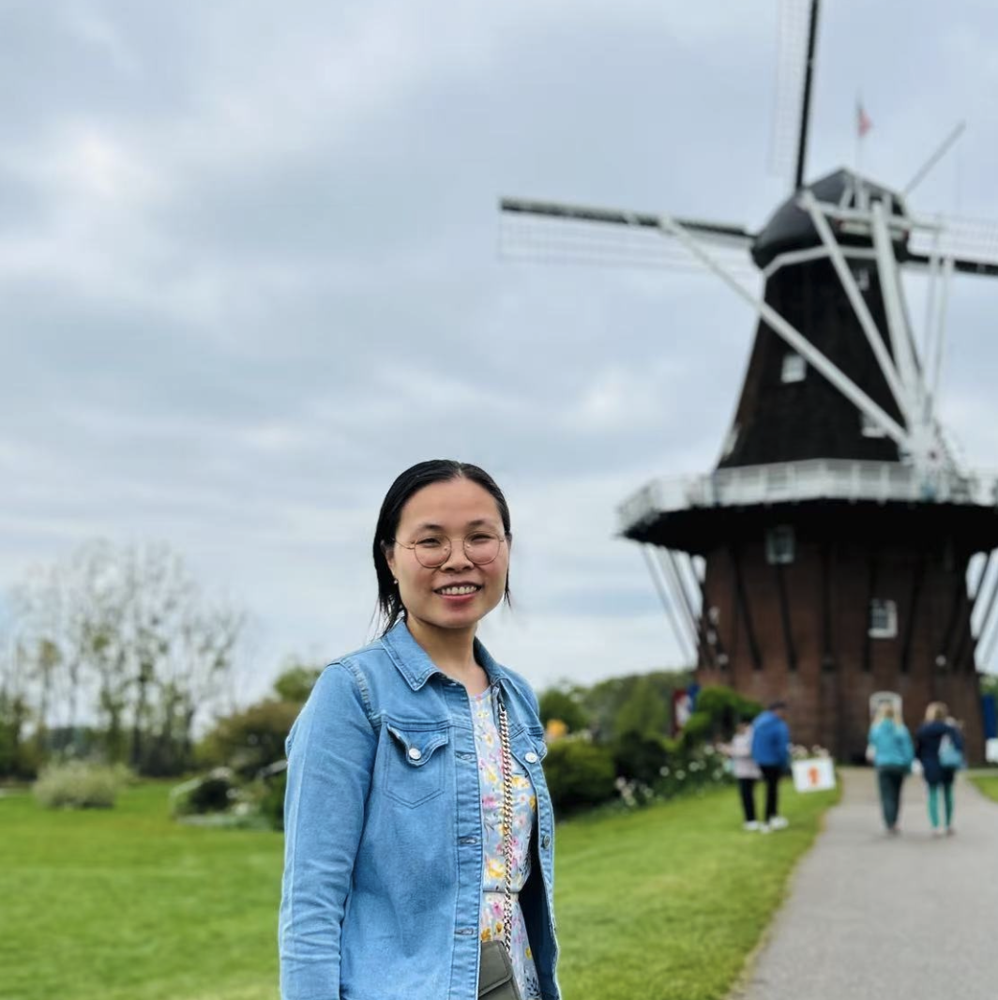
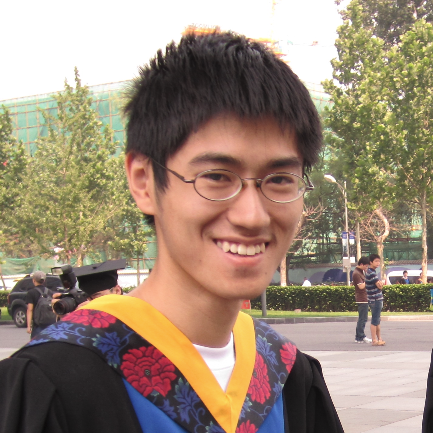
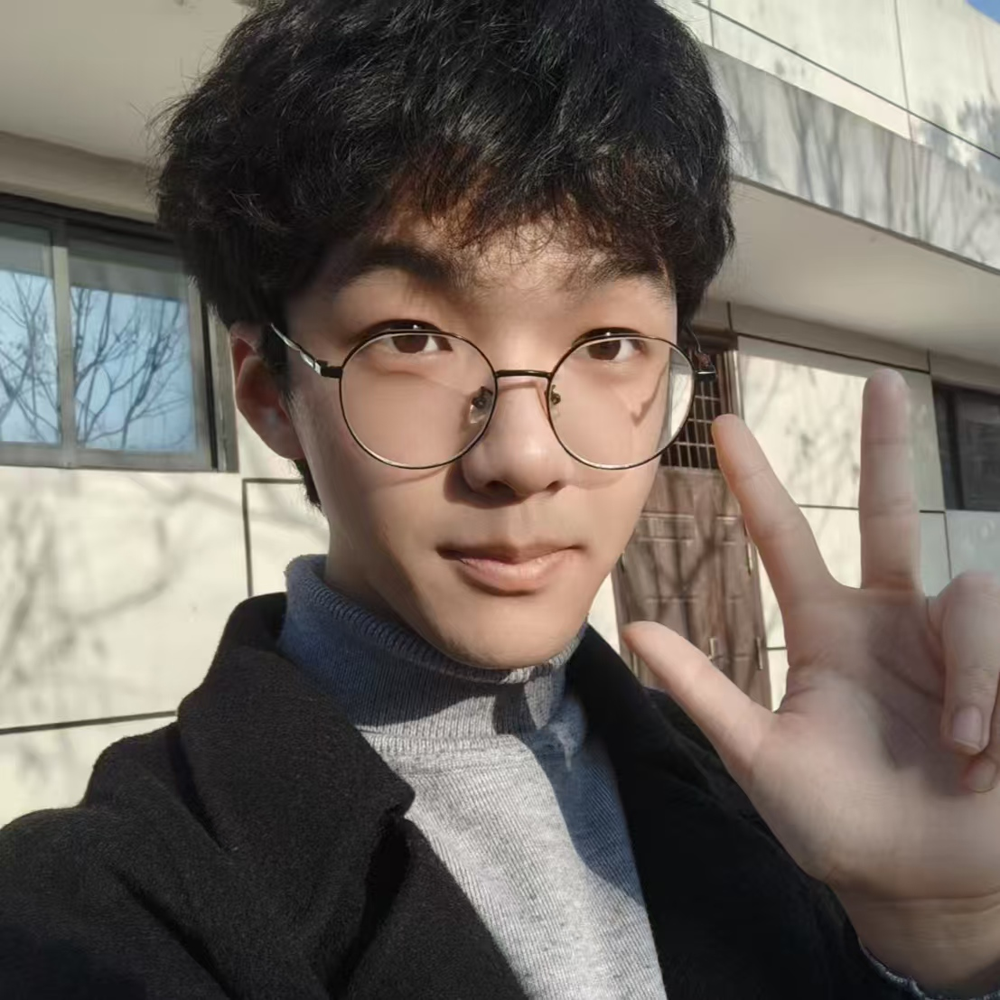
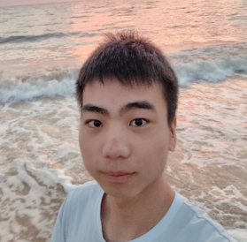
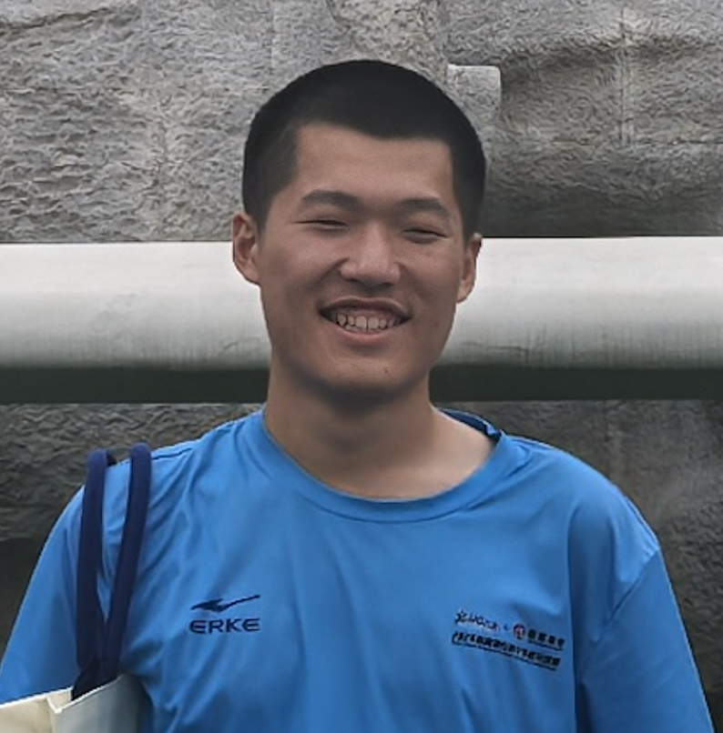

  
<!-- 
  
  
 <h1 style="color:	#000080;">PI</h1>  
  

-->

  <em style="font-size: 16px;">Dr. Wang received his Ph.D degree in Materials science and engineering from Xi'an Jiaotong University. He was a visiting scholar at BMW Manuacturing Lab of Clemson University International Center for Automotive Research (CUICAR), United States. His research focuses on computational physics and related from a perspective of fundemental particles.  </em>

 

    
  
<!-- 

  

    <em>Dr. Wang</em>
  

  

    <strong><em>PI</em></strong>
  

 
-->

  
  <em style="font-size: 16px;">Dr. Linghu received her Ph.D degree in Computational material physics from National University of Singapore (NUS). She is an expert in first-principles calculations of advanced functional materials. Her research spans the design and adjustment of material structures to achieve desired properties, with applications in solid oxide fuel cells, two-dimensional materials, and optoelectronic materials. </em>

  

    <em>Dr. Jiajun Linghu</em>
  

  

    <strong><em>Co-PI</em></strong>
  

  

 

  
  <em style="font-size: 16px;">Dr. Che received his Ph.D. degree in Physics from Xi'an Jiaotong University. He was a visiting scholar at Technische Universität Hamburg, Germany. His research interests include high-temperature ceramics, phonon thermal transport, first-principles calculations, molecular dynamics simulations, and machine learning. </em>

  

    <em>Dr. Junwei Che</em>
  

  

    <strong><em>Co-PI</em></strong>
  

 

    
 <h1 style="color:	#000080;">Research Associates</h1>  
 

 
 

 

  
  <em style="font-size: 16px;">Dr. Wang received his Ph.D. degree in Human-computer Interaction from The University of Sydney (USYD), Australia. He was a researcher at Wellbeing Tech Lab of USYD. He is an expert on artificial intelligence, image processing, and 3D reconstruction.</em>

  

    <em>Dr. Yifan Wang</em>
 
 

 

  
  <em style="font-size: 16px;">Dr. Wang received her Ph.D. degree in Pharmaceutical analysis from Zhejiang University. She was a research fellow at the University of Michigan (UMich), Ann Arbor, MI, United States. Her research focuses on biophysics.</em>

  

    <em>Dr. Lu Wang</em>
 
 

 

  
  <em style="font-size: 16px;">Dr. Huang received his Ph.D. degree in Mechanical engineering from Xi'an Jiaotong University. His research focuses on algorithm design and quantum computation. </em>

  

    <em>Dr. Wenjie Huang</em>
 

 

    
  

    
 <h1 style="color:	#000080;">Graduates</h1>  
 

 

  
  <em style="font-size: 16px;">Zhengwang received his B.S. in Mechanics from Xi'an University of Science and Technology. His research focuses on crack growth mechanics. </em>

  

    <em>Zhengwang Chen </em>
  

         

  
   <h1 style="color: #000080;">Undergraduates</h1>  

      

    

  <!-- 第1个成员 -->
  

    
    

      <em>Beijie Hu</em>
    

    <em style="font-size: 16px; margin-top: 20px; text-align: left;">
       <!--Beijie is interested in computational physics.-->
    </em>
  

  <!-- 第2个成员 -->
  

    
    

      <em>Ssegawa Raymond Mark</em>
    

    <em style="font-size: 16px; margin-top: 20px; text-align: left;">
       <!--Mark is interested in theoretical physics.-->
    </em>
  

 <!-- 第3个成员 -->
  

    
    

      <em>Xuan Zeng</em>
    

    <em style="font-size: 16px; margin-top: 20px; text-align: left;">
      <!--Xuan is interested in computational physics.-->
    </em>
  

  

 <!-- 2nd row -->

  <!-- 第1个成员 -->
  

    
    

      <em>Zidong Liang</em>
    

    <em style="font-size: 16px; margin-top: 20px; text-align: left;">
       <!--Beijie is interested in computational physics.-->
    </em>
  

  <!-- 第2个成员 -->
  

    
    

      <em>Yousra El Mouloudi</em>
    

    <em style="font-size: 16px; margin-top: 20px; text-align: left;">
       <!--Mark is interested in theoretical physics.-->
    </em>
  

 <!-- 第3个成员 -->
  

    
    

      <em>Jiajie Zhang</em>
    

    <em style="font-size: 16px; margin-top: 20px; text-align: left;">
      <!--Xuan is interested in computational physics.-->
    </em>
  

  

 <!-- 3rd row -->

  <!-- 第1个成员 -->
  

    
    

      <em>Isha Abdulai Turay</em>
    

    <em style="font-size: 16px; margin-top: 20px; text-align: left;">
       <!--Beijie is interested in computational physics.-->
    </em>
  

  <!-- 第2个成员 -->
  

    
    

      <em>Zhihao Zhou</em>
    

    <em style="font-size: 16px; margin-top: 20px; text-align: left;">
       <!--Mark is interested in theoretical physics.-->
    </em>
  

 <!-- 第3个成员 -->
  

    
    

      <em>Tianjun Wen</em>
    

    <em style="font-size: 16px; margin-top: 20px; text-align: left;">
      <!--Xuan is interested in computational physics.-->
    </em>
  

 <!-- 4th row -->

  <!-- 第1个成员 -->
  

    
    

      <em>Xiaona Sun</em>
    

    <em style="font-size: 16px; margin-top: 20px; text-align: left;">
       <!--Beijie is interested in computational physics.-->
    </em>
  

  <!-- 第2个成员 -->
  

    
    

      <em>Haoran Zhang</em>
    

    <em style="font-size: 16px; margin-top: 20px; text-align: left;">
       <!--Mark is interested in theoretical physics.-->
    </em>
  

 <!-- 第3个成员 -->
  

    
    

      <em>Xinying Quan</em>
    

    <em style="font-size: 16px; margin-top: 20px; text-align: left;">
      <!--Xuan is interested in computational physics.-->
    </em>
  

  

