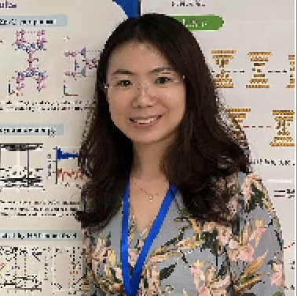

  
 <h1 style="color:	#1E90FF;">Co-PI</h1>  

  
  
Dr. Linghu gets her Ph.D degree from National University of Singapore at 2018. She is an expert in First principle calculation in Physics. She works on various topics in Physics with VASP and MDs.

 
 Dr. Jiajun Linghu 
  
 
    
      

  
 <h1 style="color:	#1E90FF;">Master Students</h1>  

  

    
    
Zhengwang Chen graduates from Xi'an University of Science and Technology at June 2024, then he joins the lab to persuit his master degree in Mechanics. 

  

 

     
Zhengwang Chen
  

  
---

