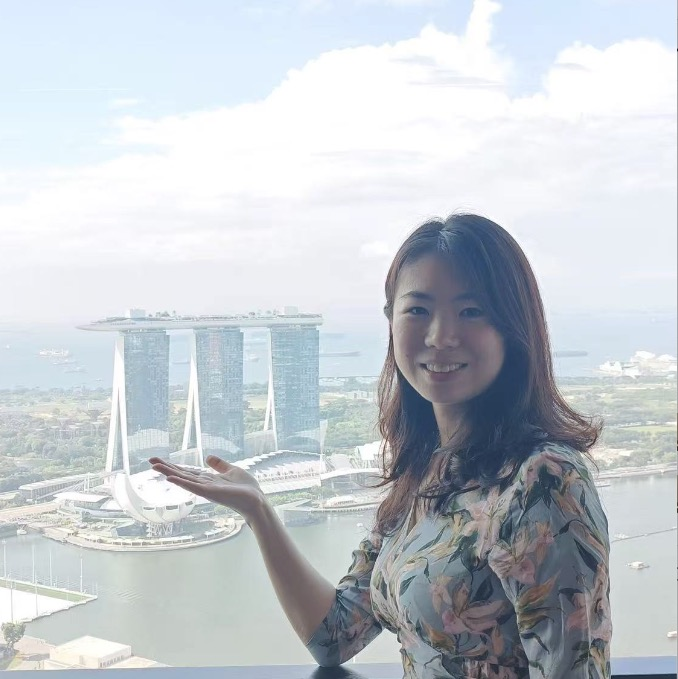
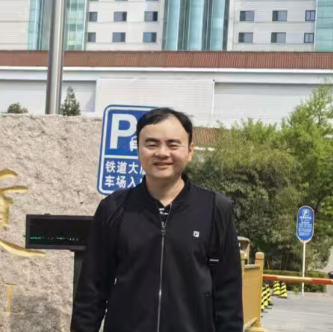
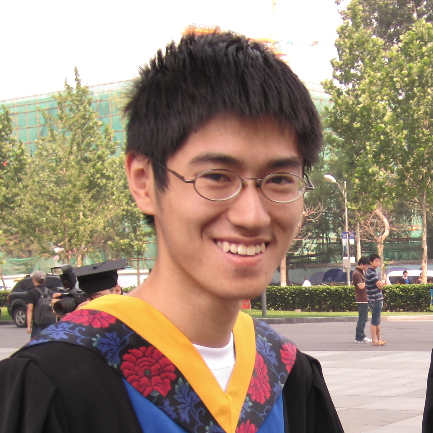
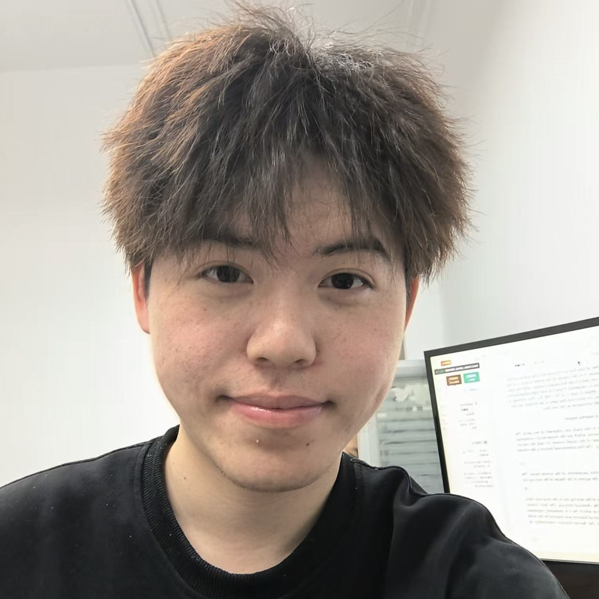
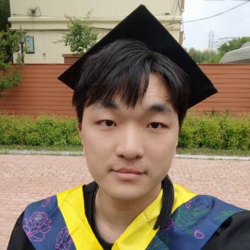
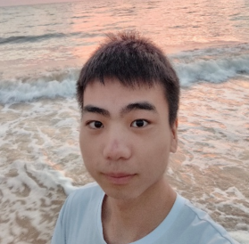
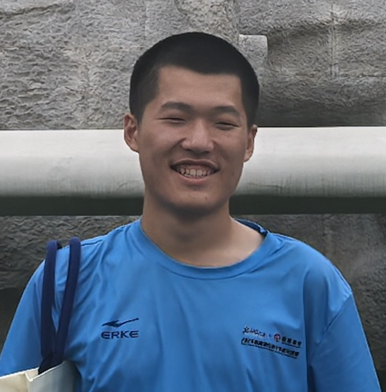
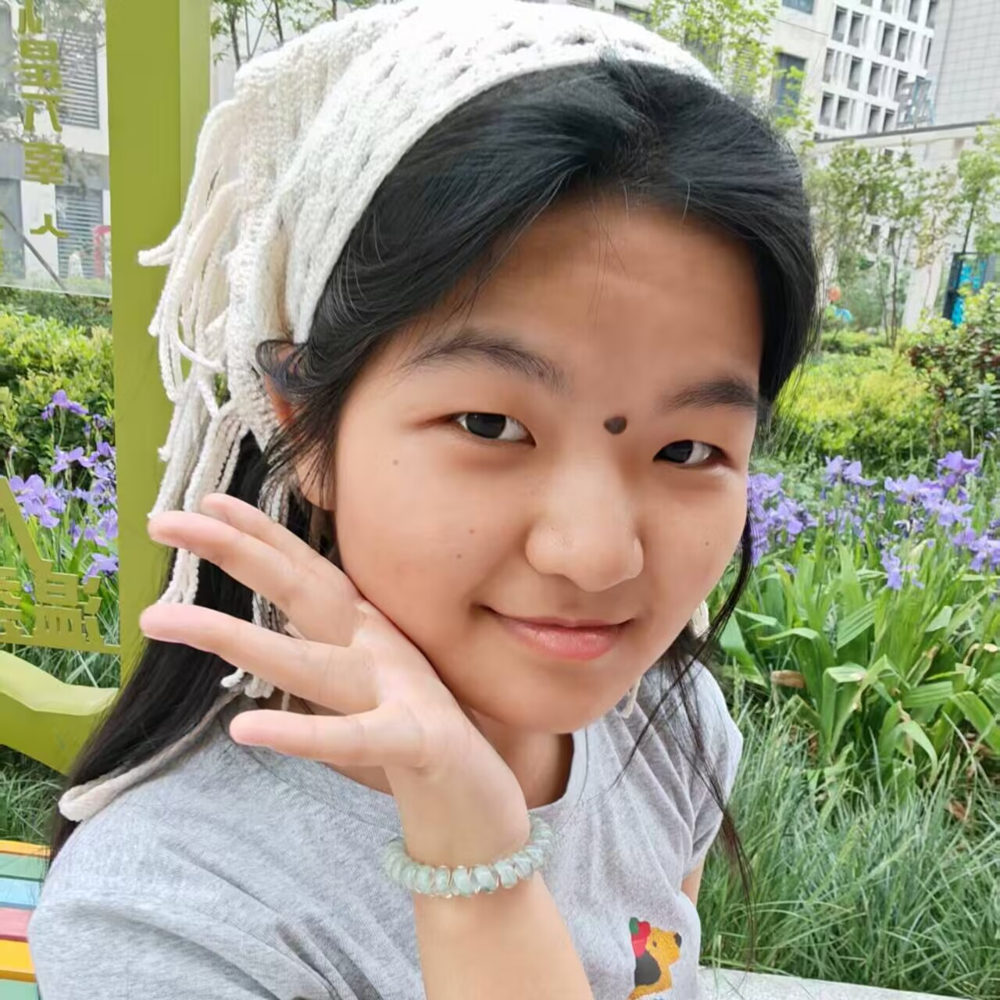

  
<!-- 
  
  
 <h1 style="color:	#000080;">PI</h1>  
  

-->

  <em style="font-size: 16px;">Dr. Wang received his Ph.D degree in Materials science and engineering from Xi'an Jiaotong University. He was a visiting scholar at BMW Manufacturing Lab of Clemson University International Center for Automotive Research (CUICAR). He is an expert in MD calculations of advanced functional materials from atomic perspectives. His research focuses on computational physics and related from a perspective of fundamental particles.  </em>

 

    
  
<!-- 

  

    <em>Dr. Wang</em>
  

  

    <strong><em>PI</em></strong>
  

 
-->

  
  <em style="font-size: 16px;">Dr. Linghu received her Ph.D degree in Computational material physics from National University of Singapore (NUS). She is an Associate professor in Physics at Chang'an University. She is an expert in first-principles calculations of advanced functional materials. Her research spans the design and adjustment of material structures to achieve desired properties, with applications in solid oxide fuel cells, two-dimensional materials, and optoelectronic materials. </em>

  

    <em>Dr. Jiajun Linghu</em>
  

  

    <strong><em>Co-PI</em></strong>
  

  

 

  
  <em style="font-size: 16px;">Dr. Che received his Ph.D. degree in Physics from Xi'an Jiaotong University. He was a visiting scholar at Technische Universität Hamburg, Germany. His research interests include high-temperature ceramics, phonon thermal transport, first-principles calculations, molecular dynamics simulations, and machine learning. </em>

  

    <em>Dr. Junwei Che</em>
  

  

    <strong><em>Co-PI</em></strong>
  

  

 

  
  <em style="font-size: 16px;">Dr. Xu received her Ph.D. degree in Theoretical Solid State Physics from RWTH Aachen University, Germany. She is currently an assistant professor in Physics at Chang'an University. Her research focuses on phase-change memory materials and quasi-two-dimensional (quasi-2D) systems, with particular emphasis on their structural evolution and electronic properties. Her work combines large-scale electronic structure analysis with advanced computational methods, including first-principles calculations, large-scale ab initio molecular dynamics simulations, and machine learning techniques for the development and optimization of interatomic potentials. </em>

  

    <em>Dr. Yazhi Xu</em>
  

  

    <strong><em>Co-PI</em></strong>
  

 

    
 <h1 style="color:	#000080;">Research Partners</h1>  
 

 
 

 

  
  <em style="font-size: 16px;">Dr. Wang received his Ph.D. degree in Human-computer Interaction from The University of Sydney (USYD), Australia. He was a researcher at Wellbeing Tech Lab of USYD. He is an expert on artificial intelligence, image processing, and 3D reconstruction.</em>

  

    <em>Dr. Yifan Wang</em>
 
 

 

  
  <em style="font-size: 16px;">Dr. Wang received her Ph.D. degree in Pharmaceutical analysis from Zhejiang University. She was a research fellow at the University of Michigan (UMich), Ann Arbor, MI, United States. Her research focuses on biophysics.</em>

  

    <em>Dr. Lu Wang</em>
 
 

 

  
  <em style="font-size: 16px;">Dr. Yi received his Ph.D. degree in Measurement Technology and Instrumentation from Beihang University. He is an expert on artificial intelligence and information perception.</em>

  

    <em>Dr. Kefu Yi</em>
 
 

 

  
  <em style="font-size: 16px;">Dr. Huang received his Ph.D. degree in Mechanical engineering from Xi'an Jiaotong University. His research focuses on algorithm design and quantum computation. </em>

  

    <em>Dr. Wenjie Huang</em>
 

 

    
  

    
 <h1 style="color:	#000080;">Graduates</h1>  
 

 

  <!-- Person 1 -->
  

    

      

      

        <em>Zhengwang Chen</em>
      

    

    

      

        <em>Zhengwang received his B.S. in Mechanics from Xi'an University of Science and Technology. His research focuses on crack growth mechanics.</em>
      

    

  

  <!-- Person 2 -->
  

    

      

      

        <em>Yuyang Kuang</em>
      

    

    

      

        <em>Yuyang received his B.S. in Mechanics from Harbin University of Science and Technology. His research focuses on AI-assisted atomic mechanics.</em>
      

    

  

         
<!-- ==================== Undergraduates ==================== -->

  <h1 style="color:#000080; font-size:20px; margin-bottom:30px;">
    Undergraduates
  </h1>

 

<!-- ===== 1st row ===== -->

  <!-- Beijie Hu -->
  

    
    

      <em>Beijie Hu</em>
    

  

 <!-- Mingxuan Li -->
  

    
    

      <em>Mingxuan Li</em>
    

  

  <!-- Xuan Zeng -->
  

    
    

      <em>Xuan Zeng</em>
    

  

<!-- ===== 2nd row ===== -->

  <!-- Zidong Liang -->
  

    
    

      <em>Zidong Liang</em>
    

  

  <!-- Yousra El Mouloudi -->
  

    
    

      <em>Yousra El Mouloudi</em>
    

  

  <!-- Jiajie Zhang -->
  

    
    

      <em>Jiajie Zhang</em>
    

  

<!-- ===== 3rd row ===== -->

  <!-- Isha Abdulai Turay -->
  

    
    

      <em>Isha Abdulai Turay</em>
    

  

  <!-- Zhihao Zhou -->
  

    
    

      <em>Zhihao Zhou</em>
    

  

  <!-- Tianjun Wen -->
  

    
    

      <em>Tianjun Wen</em>
    

  

<!-- ===== 4th row ===== -->

  <!-- Xiaona Sun -->
  

    
    

      <em>Xiaona Sun</em>
    

  

  <!-- Haoran Zhang -->
  

    
    

      <em>Haoran Zhang</em>
    

  

  <!-- Xinying Quan -->
  

    
    

      <em>Xinying Quan</em>
    

  

<!-- ===== 5th row ===== -->

  <!-- Simiao Yan -->
  

    
    

      <em>Simiao Yan</em>
    

  

  <!-- Empty space -->
  

  <!-- Empty space -->
  

  

<!-- ==================== Lab Alumni ==================== -->

  <h1 style="color:#000080; font-size:20px; margin-bottom:30px;">
    Lab Alumni
  </h1>

<table style="
  width:100%;
  border-collapse:collapse;
  font-size:16px;
  line-height:1.25;
">

  <thead>
    <tr style="background-color:#dedcdc; color:#06336b;">

      <th style="
        padding:14px;
        text-align:left;
        border:1px solid #d0d0d0;
        width:15%;
      ">
        Name
      </th>

      <th style="
        padding:14px;
        text-align:left;
        border:1px solid #d0d0d0;
        width:15%;
      ">
        Major
      </th>

      <th style="
        padding:14px;
        text-align:left;
        border:1px solid #d0d0d0;
        width:32%;
      ">
        Time at Lab
      </th>

      <th style="
        padding:14px;
        text-align:left;
        border:1px solid #d0d0d0;
        width:38%;
      ">
        Position after Graduation/Leaving Lab
      </th>

    </tr>
  </thead>

  <tbody>

    <!-- Ssegawa Raymond Mark -->
    <tr style="background-color:#f2f2f2;">

      <td style="padding:14px; border:1px solid #d0d0d0;">
        <em>Ssegawa Raymond Mark</em>
      </td>

      <td style="padding:14px; border:1px solid #d0d0d0;">
        Information
      </td>

      <td style="padding:14px; border:1px solid #d0d0d0;">
        02/2025–08/2025
      </td>

      <td style="padding:14px; border:1px solid #d0d0d0;">
        —
      </td>

    </tr>

  </tbody>

</table>

  

